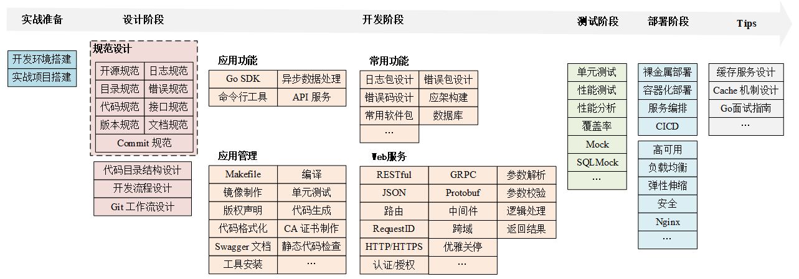
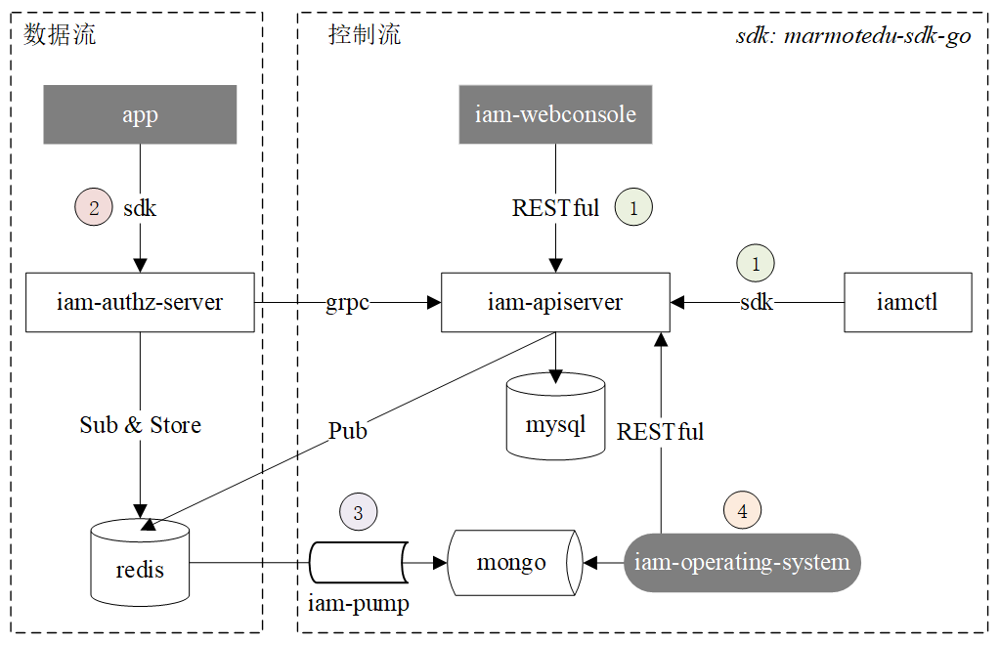

# IAM - 身份识别与访问管理系统

IAM = **I**dentity and **A**ccess **M**anagement

IAM 是一个基于 Go 语言开发的身份识别与访问管理系统，用于对资源访问进行授权。**最新稳定版本为：v1.6.2，建议基于稳定版安装测试**。

这里需要注意：
- 如果你是极客时间《Go 语言项目开发实战》专栏的读者，请使用 v1.1.0 版本（tag）
- 如果你是图书《从零构建企业级 Go 项目》的读者，请使用 v1.6.2 版本（tag）

> 更详细的版本映射请参考：[版本映射](./docs/guide/zh-CN/version_map.md)

IAM 同时也具有以下能力：

1. 配合极客时间专栏 **《[Go 语言项目开发实战](https://time.geekbang.org/column/intro/100079601?tab=intro)》**，讲解如何用 Go 做企业级应用的开发，是该项目的理论课程，包含了项目各个知识点和构建思路的讲解，也会包含我的一线研发经验和建议。

2. 作为一个开发脚手架，供开发者克隆后二次开发，快速构建自己的应用。

IAM 项目会长期维护、定期更新，**欢迎兄弟们 Star & Contribute**

## 功能特性

本项目用到了Go企业开发的大部分核心技能点，见下图：



更多请参考：[marmotedu/gocollect](https://github.com/marmotedu/gocollect)

## 软件架构



架构解析见：[IAM 架构 & 能力说明](./docs/guide/zh-CN/installation/installation-architecture.md)

## 快速开始

### 依赖检查

1. 服务器能访问外网

2. 操作系统：CentOS Linux 8.x (64-bit)

> 本安装脚本基于 CentOS 8.2 安装，建议你选择 CentOS 8.x 系统。其它Linux发行版、macOS也能安装，不过需要手动安装。

### 快速部署

快速部署请参考：[IAM 部署指南](docs/guide/zh-CN/installation/README.md#快速部署)

> IAM 项目还提供了更详细的部署文档，请参考：[手把手教你部署IAM系统](docs/guide/zh-CN/installation/installation-procedures.md)

### 构建

如果你需要重新编译IAM项目，可以执行以下 2 步：

1. 克隆源码

```bash
$ git clone https://github.com/marmotedu/iam $GOPATH/src/github.com/marmotedu/iam
```

2. 编译

```bash
$ cd $GOPATH/src/github.com/marmotedu/iam
$ make
```

构建后的二进制文件保存在 `_output/platforms/linux/amd64/` 目录下。

## 使用指南

[IAM Documentation](docs/guide/zh-CN)

## 如何贡献

欢迎贡献代码，贡献流程可以参考 [developer's documentation](docs/devel/zh-CN/development.md)。

## 社区

You are encouraged to communicate most things via [GitHub issues](https://github.com/marmotedu/iam/issues/new/choose) or pull requests.

## 关于作者

- Lingfei Kong <colin404@foxmail.com>

为了方便交流，我建了微信群，可以加我 **微信：nightskong**，拉你入群，方便交流。

## 谁在用

如果你有项目在使用iam系统模板，也欢迎联系作者，加入使用案例。

## 许可证

IAM is licensed under the MIT. See [LICENSE](LICENSE) for the full license text.
